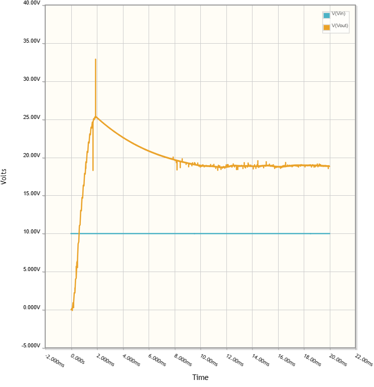

# lab1-power

    * Name: Jessi Jha
    * Description of hardware: Laptop, Lab Tools, Circuit Elements (inductors, resistors, capacitors, transistor), ATmega328PB Xplained Mini board

## Part A: Voltage Regulator

### 1 - Calculate the voltage at Node1. Show your work completely using Kirchhoff’s Law to derive the final voltage divider equation

V_out = V_in * (R_2 / (R_1 + R_2))  
V_out = 5 V * (100 Ohms / (100 Ohms + 100 Ohms))  
V_out = 2.5 V

### 2 - What if R2 was 850 ohm? What would the voltage at Node1 be? Show your work

V_out = V_in * (R_2 / (R_1 + R_2))  
V_out = 5 V * (850 Ohms / (100 Ohms + 850 Ohms))  
V_out =  4.47 V

### 3 - Attach an image of the plot generated (“Export Plot Images” in the upper right hand corner of the plot). Is this expected behavior? Why or why not?

### 4 - List three scenarios where a voltage divider would be useful

1. You could use a voltage divider for a (cheap but pretty bad) voltage regulator.
2. You could also make a variable voltage regulator with a variable resistor (perhaps a potoentiometer that varies with light) if you want V_out to vary.
3. You also provide varying voltages from the same voltage supply (by connecting different circuit elements to the appropraite node in between resistors)

### 5 - When does the MOSFET (“switch”) become active - when the pulse of the clock (CLK1) is high or low? Why?

We used a P-MOSFET in this Buck Converter, thus the transistor allows current to pass when there is 0V applied to the gate. This means the "switch" becomes active when the pulse of the clock is low.

### 6 - In order for Vout to be 3.3V, what duty cycle should be selected for the clock (CLK1)? What about for 2V? Do the values make sense? Why or why not?

Vout = 3.3 V:
The duty cycle is 0.354.

Vout = 2 V:
The duty cycle is 0.52.

It makes sense that the lower the duty cycle the higher the output voltage - remember, we are using a P-MOSFET in this configuration. This means that current flows across the transistor when the clock is low, therefore the capacitors also charge when the clock is low. If we have a lower duty cycle (i.e., more of the time the clock is low) we are charging our capacitors for longer, leadering to an overall higher output voltage.

### 7 - Zoom into 2.8V to 5.0V. Explain the behavior you see - namely, why is there a spike at around 100us and why is the steady state output not a straight horizontal line? Attach an image of the generated plot

Let's consider the part of the circuit that occurs after the transistor (or "switch"). We can consider this an RLC circuit, where Vout is defined by a damped wave equation. The damping coefficient (which can be found using circuit analysis tecniques) determines how Vout will change from its transient to steady state.

### 8 - Explain the relationship between these three currents. (Hint: KCL) Is this expected? Why or why not? Attach an image of the generated plot

The sum of these three currents (the current through the diode, the current through the transistor, and the current through the inductor) adds to zero. In other words, yes, KCL holds, as the current through the node connecting these three components adds to zero.

### 9 - Attach an image of the generated plot

  

### 10 - Explain the relationship between these three currents. (Hint: KCL) Is this expected? Why or why not?

The sum of these three currents (the current through the diode, the current through the transistor, and the current through the inductor) adds to zero. In other words, yes, KCL holds, as the current through the node connecting these three components adds to zero.

## Part B: Arduino Power Management

### 11 - Manipulate the Barrel Jack voltage and USB voltage sources and fill out the following table. In the Power Source column, fill out whether the USB is used as a voltage source or the Barrel Jack

| **Jack**  | **USB**  | **Power Source?**  | **NODE1**  | **NODE2**  | **NODE3**  |
|---------- |--------- |------------------- |----------- |----------- |----------- |
| 0V        | 5V       |        USB         |   4.999 V  | -1.014 mV  |   2.499 V  |
| 10V       | 0V       |        Jack        |   5.001 V  |    5.00 V  |   2.500 V  |
| 10V       | 5V       |        Both        |   5.001 V  |    5.00 V  |   2.500 V  |
| 5V        | 5V       |        Both        |   4.306 V  |   4.307 V  |   1.806 V  |

### 12 - Is it possible to connect the barrel jack voltage directly to the non-inverting input of the op amp and still get the desired output? If not, what changes would need to be made to the circuit?

Well if you connect the barrel jack to the non-inverting input of the op amp, then to voltage difference between the two pins would be zero. Since the output of the op amp is proportional to the differnce between the two input pins, our output would be zero (which is not what we want)! In order to fix this, we would need to connect one of the pins to a different voltage source, or perhaps connect one of the input pins to the output of voltage divider (to ensure a diffeence between the two inputs).

### 13 - Why do you think that 3.3V is used as the reference voltage for the op-amp in this circuit and why is the voltage divider needed?

We use 3.3 V as a reference voltage because we want the non-inverting input to be greater than the inverting input. However, we need the voltage divider because so that the voltage difference between the terminals is not so large that the op-amp stops working in the linear regime.

## Part C: Boost Converter Implementation

### 14 - For a 10V input what is the output?

The output is about 20.77 V.

### 15 - Keeping the input voltage the same while changing the PWM to 20%, 35% and 50%. Measure the output voltage for each PWM. What is the relationship between input voltage, PWM and output voltage?

For PWM = 50%:   
The output is about 20.77 V   

For PWM = 35%:
The output is about 16.53 V   

For PWM = 35%:   
The output is about 12.70 V   

It apears that the larger the duty cycle, the larger the output voltage is. This makes sense because was we decrease the duty cycle, the amount of time the transistor "switch" is on decreases. Thus, the inductor and capacitor have less time to charge, meaning Vout will be less.

### 16 - Keeping the input voltage, and PWM the same while changing the frequency to 20 KHz, 50 KHz and 100 KHz.  Record output voltage for each.  What conclusion can you draw from the readings?

For f = 100 kHz:
The output is about 18.39 V

For f = 50 kHz:
The output is about 18.64 V

For f = 20kHz:
The output is about  18.89 V

As the frequency decreases, I notice that Vout increases slighty. This is because the when we decrease the frequency of a wave, the wavelength (and thus, the time the wave is in the "on" position) is longer. This means the capacitor and inductor have more time to charge per cycle.

### 17 - Is the output different from the simulation output? If so, what’s the difference and why? How can you improve the performance of the physical circuit?

One way to improve the performance of the circuit is to reduce noise. You could do this by adding another capacitor into your cicruit. Essentially, capacitors take in a noisy voltage signal and then discharge a "smoother" (less noisy) signal. By adding multiple capacitors, you can obtain a signal that has less noise. 

## Part D: Linear Regulator

### 18 - Assuming an ideal linear regulator (i.e. the current that goes into the linear regulator is the same value for output current)  and knowing that the power equation is PWR = V * I, what would be the power efficiency of a 5.0V to 3.3V linear regulator? Why are linear regulators primarily used for low voltage drops from input to output?

PWR_in = 5 V * I_load   

PWR_out = 3.3 V * I_load  

PWR_efficiency = 3.3 V * I_load / 5 V * I_load = 0.66

Linear regulators are primarily used for low voltage drops because the power efficiency decreases as you increase the voltage drop.

### 19 - Your task is to finish the table below. Plug in your ATmega Xplained board. Use the GND pin as reference, measure the voltages at pin A, B, C, D with a multimeter. Then, match the pins to their names on the schematic in Figure 14. Make sure that you understand what each pin does and write a short explanation for each pin

| **Fig 13 Label**  | **Voltage**  | **Pin Name in Schematic**  | **Explanation**                       |
|------------------ |------------- |--------------------------- |-------------------------------------- |
|         GND       |      0V      |             GND            | Connects to the ground on the board.  |
|          A        |     1.22V    |              EN            |   |         
|          B        |     3.31V    |           BYPASS           |   |  
|          C        |     5.14V    |             VIN            |   |  
|          D        |     5.14V    |             OUT            |   |  

## Part E: Buck-Boost

### 20 - Attach an image of your schematic and the share link. (File > Link & Share)

  
https://www.circuitlab.com/circuit/vhk6tfk2e5mk/ese-3500-lab-1-buck-boost-regulator/

### 21 - For a given input voltage, attach a plot showing the schematic demonstrating buck (step down) capabilities

### 22 - For the same input voltage as Question 21, attach a plot showing the schematic demonstrating boost (step up) capabilities

## Github Repo Submission Resources

* [ESE5160 Example Repo Submission](https://github.com/ese5160/example-repository-submission)
* [Markdown Guide: Basic Syntax](https://www.markdownguide.org/basic-syntax/)
* [Adobe free video to gif converter](https://www.adobe.com/express/feature/video/convert/video-to-gif)
* [Curated list of example READMEs](https://github.com/matiassingers/awesome-readme)
* [VS Code](https://code.visualstudio.com/) is heavily recommended to develop code and handle Git commits
  * Code formatting and extension recommendation files come with this repository.
  * Ctrl+Shift+V will render the README.md (maybe not the images though)
